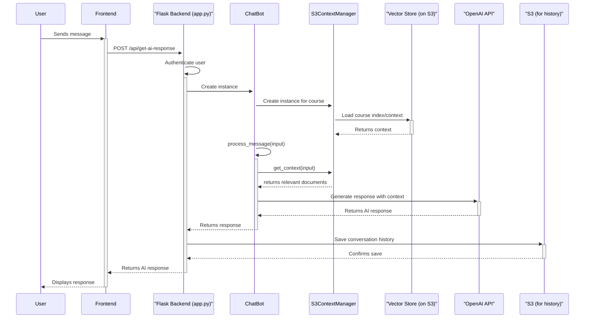

# speech-driven-lessons

## Backend Architecture and Workflow

## 1. Overview

This document provides a detailed description of the backend architecture for the AI Tutor platform. The backend is responsible for handling course creation, content generation, AI-powered chat interactions, and real-time communication for in-class experiences.

The backend is built using a modern Python technology stack:

-   **Web Framework:** Flask
-   **Real-time Communication:** Flask-SocketIO
-   **AI/ML:** OpenAI (for chat), Google Gemini (for content generation)
-   **Data Storage:** AWS S3 for file storage (course materials, conversation history) and a vector store (likely FAISS, stored on S3) for Retrieval-Augmented Generation (RAG).
-   **Authentication:** Firebase Authentication

## 2. Architecture

The backend is designed with a modular architecture, with clear separation of concerns. The main components are:

-   **Flask Application (`app.py`):** The main entry point of the backend. It initializes the Flask app, configures CORS, registers API blueprints, and sets up Socket.IO for real-time communication.
-   **API Endpoints (`api/` and `routes/`):** These directories define the RESTful API for the application. The endpoints are organized into blueprints based on functionality (e.g., `course_generation`, `ai_tutor`, `uploads`).
-   **Chat Logic (`chatbot.py`):** The `ChatBot` class encapsulates the logic for handling chat interactions. It works with the `S3ContextManager` to retrieve relevant context and interacts with the OpenAI API to generate responses.
-   **Content Generation (`course_content_generation/`):** This module is responsible for generating course content using Google's Gemini models. It can generate course outlines and detailed slide-by-slide content with accompanying speech.
-   **Data and Context Management (`s3_context_manager.py`, `utils/`):** These modules handle all interactions with AWS S3, including storing and retrieving files, managing course context for the RAG system, and handling user data.
-   **Real-time Server (`chatServer.py`):** Although not fully integrated into the main Flask app in the provided code, this suggests a separate server or a component for handling more complex real-time chat scenarios, possibly using WebSockets.

The following diagram illustrates the typical workflow for an AI chat interaction:

## 3. Core Workflows

### Course Creation & Content Generation

1.  **Upload Initial Documents:** The user uploads initial course materials (e.g., a syllabus, notes) through the frontend. The `upload_routes.py` endpoint on the backend receives these files and stores them in a dedicated folder for the course on AWS S3.
2.  **Generate Course Outline:** The frontend triggers the course outline generation. The backend's `course_generation_routes.py` calls the `gemini_course_outline_generator.py` module. This module uses the Google Gemini API to read the initial documents and generate a structured course outline in JSON format.
3.  **Generate Slides and Speech:** Once the outline is approved, the backend uses `gemini_slide_speech_generator.py` to generate the detailed content for each slide, including the text and a script for text-to-speech conversion.
4.  **Create Vector Index:** After the content is generated, the backend processes the text content of the slides. It chunks the text, generates embeddings (using an OpenAI model), and creates a vector index (e.g., using FAISS). This index is then saved to S3. This index is crucial for the RAG system.

### Chat Interaction (Retrieval-Augmented Generation - RAG)

The chat functionality allows the AI to answer questions based on the specific content of a course.

1.  **Initialize Chatbot:** When a user starts a chat for a course, the frontend calls the `/api/initialize-chatbot` endpoint. The backend creates an instance of `S3ContextManager`, which loads the pre-computed vector index for that course from S3 into memory.
2.  **User Sends Message:** The user types a message in the chat interface. The frontend sends this message to the `/api/get-ai-response` endpoint.
3.  **Retrieve Relevant Context:** The `ChatBot` instance receives the user's message. It uses the `S3ContextManager` to query the vector index. The query finds the most relevant chunks of text from the course materials based on the user's question.
4.  **Generate Response:** The retrieved text chunks (the context) are prepended to the user's message and a system prompt, and this combined text is sent to the OpenAI API (e.g., `gpt-4`). This technique, known as Retrieval-Augmented Generation (RAG), allows the AI to provide answers that are grounded in the course content, reducing hallucinations and improving accuracy.
5.  **Save History and Return Response:** The AI's response is sent back to the user. The backend also saves the user's question and the AI's response in a JSON file (`course_history.json`) on S3 for future reference.

### Real-time Features

The backend uses Flask-SocketIO to provide real-time functionality for the in-class experience.

-   **Rooms:** When a user joins a course, they join a specific "room" for that course's assistant ID. This allows the backend to send targeted messages to all users in a specific class.
-   **Slide Navigation:** When the instructor (or the AI) changes the slide, the backend emits an `update_viewing_slide` event to all users in the room, ensuring that everyone's view is synchronized.
-   **Live Interaction:** The Socket.IO connection can be used for other live interactions, such as polls, Q&A sessions, and real-time subtitles.

## 4. Data Management

-   **AWS S3:** S3 is the primary data store. Each user has a dedicated "folder" in the S3 bucket. Inside each user's folder, there are sub-folders for each course they have created. A typical course folder contains:
    -   `course_config.json`: Configuration for the course, including the system prompt for the AI.
    -   `course_history.json`: The chat history for the course.
    -   The vector index files (e.g., `faiss_index.bin`).
    -   The original uploaded documents.
    -   Generated course content (slides, etc.).
-   **Redis (`dump.rdb`):** The presence of `dump.rdb` suggests that Redis is used, likely for caching, session management, or as a message broker for Socket.IO, improving performance and scalability.

## 5. Authentication

User authentication is handled through Firebase.

1.  **Login on Frontend:** The user logs in on the frontend using Firebase Authentication.
2.  **Send Token to Backend:** For requests that require authentication, the frontend includes the user's Firebase ID token in the `Authorization` header.
3.  **Verify Token on Backend:** The `user_utils.py` module on the backend contains a function that verifies the ID token with Firebase. If the token is valid, the backend processes the request. If not, it returns an "Unauthorized" error.

This architecture provides a robust and scalable foundation for the AI Tutor platform, enabling advanced features like on-demand content generation, context-aware AI chat, and real-time collaborative learning experiences. 
